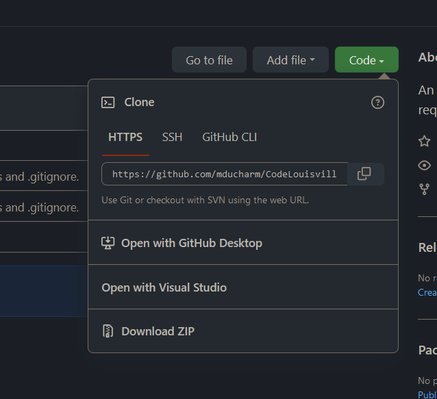

# Code Louisville Git Exercise

Git is an essential part of a software developer's toolkit. This exercise will involve making a pull request with a small change, so you can see how developers collaborate.

## Steps

1. [Fork](#fork-the-repository)
1. [Clone](#clone-the-repository)
1. [Branch](#create-a-branch)
1. [Make a commit](#make-a-commit)

### Fork the repository

Forking creates a copy of the repo, where you're free to make changes.


When contributing to a public repo, you typically make changes to your forked repo, and then create a request for your changes to be merged into the main repository (i.e. a pull request).

### Clone the repository

Cloning a repo is when we copy the source code onto our local machine. You can clone a repo by clicking on the `Code` button to copy the repo's URL, and then running the command below:



```powershell
git clone https://github.com/mducharm/CodeLouisville_GitExercise.git
```

### Create a branch

We create *branches* to group related changes.

```powershell
git checkout -b add-greeting
```

### Make a commit

In the `Program.cs` file, add a greeting with your name like this below:

```csharp
Console.WriteLine("Hello! I'm ___");
```

```powershell
# stage the changes 
git add Program.cs 
# `git add *` to add all changes

# commit the changes
git commit -m "added my greeting"

# push your new commit to GitHub
git push origin main
```

Note: when cloning a forked repo, it should automatically set the `origin` remote to be the URL of your forked repo. If for some reason this doesn't happen, you can add and view the current remotes for your cloned repo like so:

```powershell
# add a remote
git remote add origin https://github.com/{your_username}/CodeLouisville_GitExercise.

# view existing remotes
git remote -v
```
